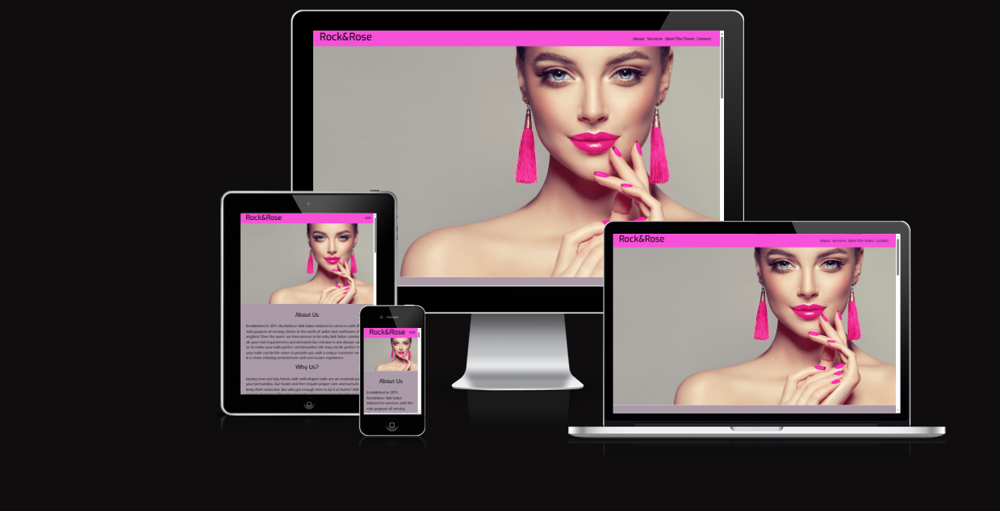
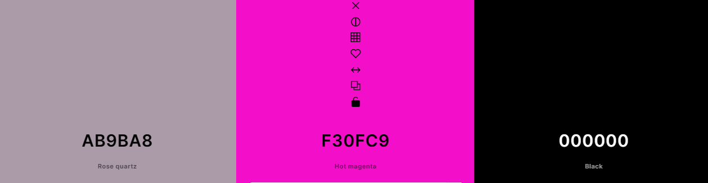
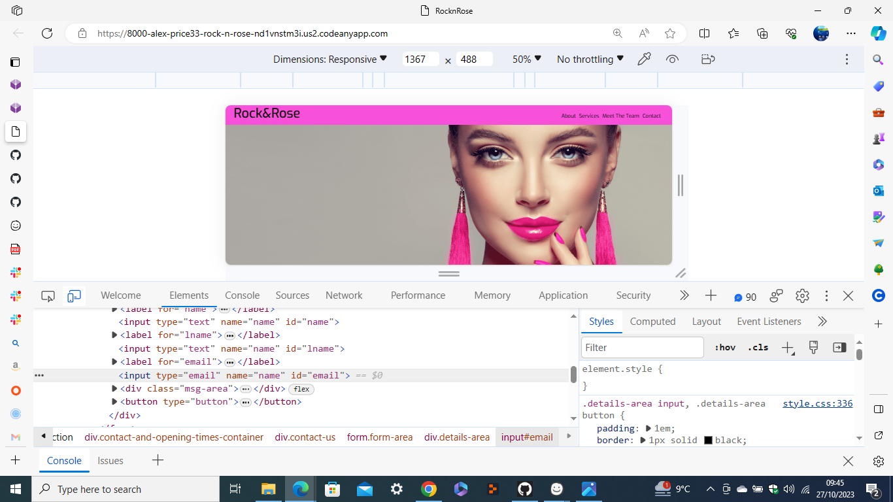
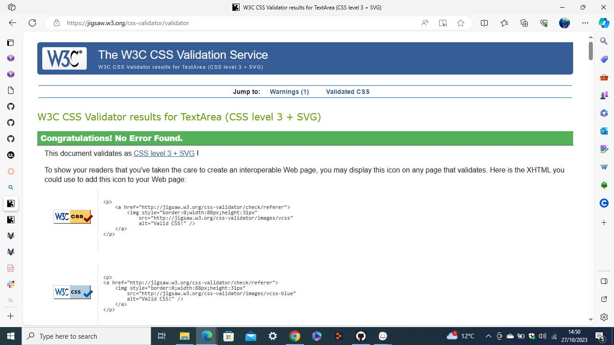

# Rock and Rose beautician salon project.

## Code Institute - First Milestone Project: User Centric Frontend Development.

 [Link to live site here](https://alex-price33.github.io/Rock-n-Rose-project/)

 

This website has been created to show my ability to design and create a website using html and CSS.

Rock and Rose has been created to show a functioning website that allows the user to meet the staff, learn about the company and find out what services Rock and Rose offers to the customer.

# Table of Contents

- [Rock and Rose Nail Salon](https://alex-price33.github.io/Rock-n-Rose-project/)
  - [Code Institute - First Milestone Project: User Centric Frontend Development.](#code-institute---first-milestone-project-user-centric-frontend-development)
- [Table of Contents](#table-of-contents)
  - [Demo](#demo)
    - [A live demo to the website can be found here](https://alex-price33.github.io/Rock-n-Rose-project/)
  - [UX](#ux)
  - [User stories](#user-stories)
    - [Strategy](#strategy)
    - [Scope](#scope)
    - [Structure](#structure)
    - [Skeleton](#skeleton)
    - [Surface](#surface)
  - [Technologies](#technologies)
  - [Features](#features)
    - [Existing Features](#existing-features)
    - [Features Left to Implement](#features-left-to-implement)
  - [Testing](#testing)
    - [Validator Testing](#validator-testing)
    - [Bugs](#bugs)
  - [Deployment](#deployment)
  - [Credits](#credits)
    - [Content](#content)
    - [Media](#media)
    - [Acknowledgements](#acknowledgements)

## User Experience (UX)
There are two main groups this website is targetting.Its is aimed at current clients and possibly new clients who have came across the website while online.The site is made to be simple and easy to navigate.

## User stories
As the only developer of this website, my goal is to ensure the website is easy to navigate and to provide an easy, informative website that the user can :

-As a user, I want to understand the purpose of this website quickly and easily.
- As a user, I want to easily navigate this website (by using a mouse, a keyboard, or a touch screen).
-As a user, i want to be able to see what services this website offers.
-As a user, i want to be able to see when the shop itself is open.
-As a user, i want to be able to see the staff and there experience.

### Strategy
The goal is to make a well-functioning professional website that entices the user into visiting the salon.

### Scope
For the users i wanted to make a simple informative website that they could easily find all services and any other information they required.

### Structure
My website consinsts of a single scrolling page with 5 sections including a navbar at the top of the page and a fixed footer at the bottom.
**Website Sections:**
1. **_Header/nav:_** This contains the logo and a navbar that links to ther sections of the website.
2. **_About:_** This is just a brief overview of the salon and the aims and ambitions of the owner.
3. **_Services:_** A section of the services and price list of what the salon has to offer .
4. **_Meet the team:_**  This is a section about the staff and there personal instagram links.
5. **_Contact:_** A contact page featuring basic contact information, and a form for the user to enquire with the salon taff
6. **_Footer:_** This is not the main section of the website but rather an ending to the website with social media links.

### Skeleton
The website is designed to be clear and simple. And the site has a simple tree structure with hierarchical flows from top to bottom.

**Wireframe**
The wireframe is designed using Balsamiq software. The first draft was edited with the guidance of the mentor. At first i was planning on making my website on seperate pages but after speaking with my mentor decided that a single scrolling page would be better. 
 [View wire frames here](./assets/readme-assets/balsamic-wireframe.pdf)

 ### Surface
I have chosen a simplistic three color approach.ive used black text and interchanged the background colors from a pink to a gray.

_Main color palette_

## Technologies
1. HTML - To create a basic site
2. CSS - To create a nice, standout front-end and to give a great user experience
3. Balsamiq - To create a wireframe

## Features
### Existing Features
* **Navigation Bar**
  * The navigation bar is at the top of the page, and it is fixed to the top. The logo is in the left-hand corner of the navigation,

  * The other navigation links on the website are to the right. About, Service, Meet the team and Contact connect to different sections of the same page.

  * The font color is the same as all other font colors on page to keep in consistency. The hover effect is used for navigation, so the user can know which page they are on.

* **Hero image**
  * Ive used a hero image underneath my navbar as i found it looks better to break up the information on my page and the colors in the image match the color profile in my design.

* **About**
 * In the about section the about a brief introduction to when the shop was opened and what they are trying to achieve
  * underneath the about is a why us and that is to persuade the customer to use the salon.

* **Services**
* This is the services section containg all services provided by the salon and is split into three categories.
* Nails: what nail services are offered and the price of the treatment.
* Brows: what eyebrow services are offered and the price of the treatment.
* Lashes: what lash services are offered and the price of the treatment.

* **Meet the team**
* This is the the team section and is split into two boxes with a profile of the staff and what services they provide.

* **Contact us**
* This is the contact us section containing a form for the customer to fill out with there details .it also contains an opening times container with some basic information.

* **Footer**
* Ive also added a footer containg social media links.

### Features Left to Implement
In the future, 
* I would like to add a book online form where the user can see available dates and have a link for a deposit to be paid.
* I would like to make the contact form functional.
* I would like to add a phot gallery with different images of clients and there chosen procedures.
* I would like to improve the performance of the website.

# Rock and Rose- TESTING

## CONTENTS

### HTML validator

- Index html page has zero warning or errors

### CSS validator

- style css page has zero warning or errors

* **Accessibility**
  -I confirmed that the colors and fonts chosen are easy to read and accessible by running it through [Lighthouse DevTools](./assets/readme-assets/lighthouse-dev-tools.png)

### Mobile testing

  - I ran my website through lighthouse with the mobile setting.
 [Lighthouse DevTools](./assets/readme-assets/mobile.png)

### Desktop testing

 I ran my website through lighthouse with the desktop setting.
 [Lighthouse DevTools](./assets/readme-assets/lighthouse.png)

### Bugs

* **Solved bugs**
* When i checked my site on a samsung galaxy fold i noticed the image containers in the meet the team section were to large for their containers.this was a simple fix of shortening the heights and widths to fit their containers.

* **Unfixed bugs**

* When I checked my site on a samsung galaxy fold i found the navbar and logo were to close together and the image container was to big in the meet the team section of my website.

* When I checked my site on a samsung galaxy fold in the opening times section the email address is to large for its container .

## Deployment
* The site was deployed to Git Hub pages using the following steps:
  * In the Github repository, the Stetting tab.
  * Under General, navigate to Code and Automation and select 'Pages'.
  * In the Build and Deployment section for Source, select 'Deploy from a branch' from the drop-down list.
  * For Branch, select 'main' from the drop-down list and Save.
  * On the top of the page, the link to the complete website is provided.
  
  - The deployed site will update automatically upon new commits to the master branch.

## Credits

### Code Used

- Most of the code in this project was written my myself, references to previous tutorials have been made with some of the code also, weather thats remembering a syntax, or re jogging my memory.

- I had to take code from the following sources below.

- For the image container i used the the [LoveRunning](https://learn.codeinstitute.net/courses/course-v1:CodeInstitute+CSE101+2020_Q2/courseware/be0e510a3aca4bccb6e0bba4cf7cf06b/6eb8cfc87bfd434a87861a844e00b655/)

- For my navbar toggle i took some inspiration from [KevinPowell](https://www.youtube.com/watch?v=8QKOaTYvYUA&t=846s) and altered the code to suit what i wanted from youtube video.

- For my footer i used some of the code from my [LoveRunning](https://learn.codeinstitute.net/courses/course-v1:CodeInstitute+CSE101+2020_Q2/courseware/be0e510a3aca4bccb6e0bba4cf7cf06b/cbb28fc16a35417bb73450e0dc71d59b/) and again altered it to suit my specific requirements.

### Media
The imge used as a background image is taken from [google](https://www.google.co.uk/search?sca_esv=577486022&sxsrf=AM9HkKnFbScP0U7hcMKS11zcT-LYt4jNTw:1698520928540&q=grey+and+pink+model+with+nails&tbm=isch&source=lnms&sa=X&ved=2ahUKEwiY99rEu5mCAxXISUEAHZYXCsQQ0pQJegQIDBAB&biw=1271&bih=654&dpr=1)

### Acknowledgements
* The the Code Institute tutor support team for helping me with the correct guidance.
* My mentor, Medale Oluwafemi, for his invaluable guidance.
* My fellow student, Craig Hudson_lead for his help in assisting me.
* Al other members of the slack community.

